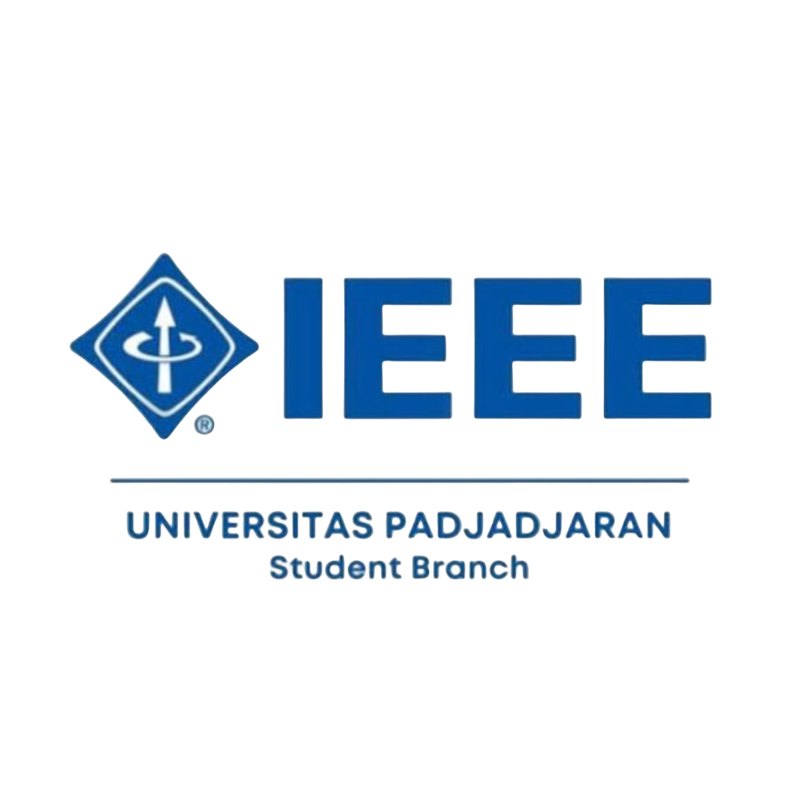

# IEEE SB UNPAD UI/UX Redesign



This project is a complete UI/UX redesign and front-end implementation for the **IEEE Student Branch Universitas Padjadjaran** website. Built with React and Vite, the website focuses on a modern, premium, and professional aesthetic, heavily featuring the organization's official color palette (IEEE Blue and Unpad Orange).

## 🚀 Features

- **Modern & Premium Design**: Clean layouts, high-quality typography (Plus Jakarta Sans), and subtle mesh gradient backgrounds.
- **Dynamic Animations**: Smooth scroll and entry animations powered by `motion/react`.
- **Fully Responsive**: Mobile-first architecture ensuring the website looks perfect on desktops, tablets, and smartphones.
- **Glassmorphic Navigation**: A dynamic, transparent-to-solid navigation bar that adapts based on user scrolling.
- **Key Pages Implemented**:
  - `Home`: Engaging animated hero section featuring the iconic Unpad building.
  - `About`: Detailed history, Cabinet Vector philosophy, and structural department cards.
  - `News & Events`: Dynamic tabs for filtering recent activities and seminars.
  - `Publications`: Dedicated sections for technical papers and articles.

## 🛠️ Tech Stack

- **Framework**: React 18
- **Build Tool**: Vite
- **Routing**: React Router DOM
- **Styling**: Vanilla CSS (CSS Variables, Flexbox, CSS Grid)
- **Animations**: Motion (Framer Motion)
- **Icons**: Lucide React

## 📦 Getting Started

To run this project locally on your machine, follow these steps:

### Prerequisites
Make sure you have [Node.js](https://nodejs.org/) installed on your machine.

### Installation
1. Clone the repository:
   ```bash
   git clone https://github.com/salmanri/ieee-sb-unpad-uiux.git
   ```
2. Navigate to the project directory:
   ```bash
   cd ieee-sb-unpad-uiux
   ```
3. Install the dependencies:
   ```bash
   npm install
   ```
4. Start the development server:
   ```bash
   npm run dev
   ```
5. Open your browser and visit `http://localhost:5173/`.

## 🤝 Maintainers
Developed for IEEE SB Universitas Padjadjaran (Cabinet Vector 2024/2025).
